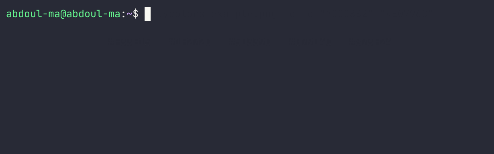
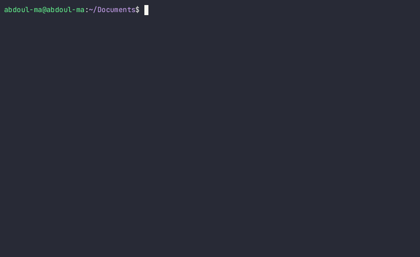
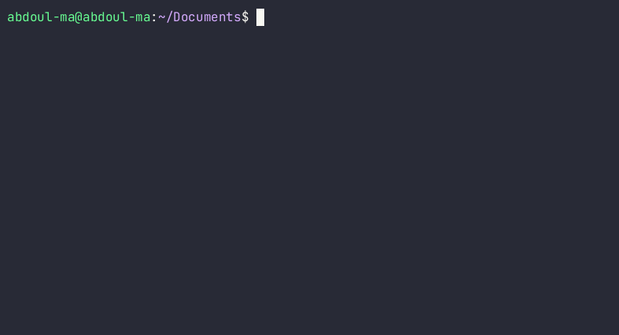

**copycolors** is command-Line Interface to extract the dominant colors from local or remote images faster.

It is built with Rust and is essentially based on the implementation the _Colors Thief_ algorithm written by  
[Yevhenii Reizner](https://github.com/RazrFalcon/color-thief-rs).

## Installation

copycolors CLI can be installed from different sources:

- You can get sources and pre-built binaries (for Linux and Windows) for the latest release of copycolors from the [releases page](https://www.github.com/abdoulma/copycolors/releases).

- If you have a Rust toolchain installed, you can also install the latest development version with `cargo install --git https://github.com/abdoulma/copycolors`.

## Usage

copycolors comes with a set of features that you can use through arguments.

### Basic example

```bash
# For a local image file example.png
copycolors example.png
# or
copycolors path/to/example.png

# For remote image
copycolors "https://www.example.com/example.png"
```

For example,  let's take a local image `example.png`.

<div align="center">


</div> 
Now, let's try to extract the 5 dominant colors of this  image: 


Instead of the path to your local file, you can provide the link to the remote image file. 

For example, let's extract the dominant colors  from an illustration from the NY Times, hosted at : <https://static01.nyt.com/images/2023/06/02/business/02adviser/02adviser-threeByTwoSmallAt2X.jpg?format=pjpg&quality=75&auto=webp&disable=upscale>


You can choose the numbers of colors you want to extract with the `--nb-colors` option (or with its shorter version `-n`). The default is `5`.

```
copycolors example.png -n 8
```


If you want to display the `rgb` value of the colors instead of hexadecimal, you can use the `--rgb` (or `-r`) flag.

```
copycolors example.png -r
```


If you want a better and broader perception of the extracted colors, you can use the `--canvas` (or `-c`) flag to display the colors as rectangle.


As, I know that it can be frustating to have some colors we don't want to extract, there is an `exc-colors` (or `-e`) option, which you can use to specify to hexadecimal value of colors you want to exclude of extraction. Under the hood, there is a method that filters out colors that are less than `5 %` distant of the colors you want to exclude.

```
# Put the colors hexadecimal values between quotations marks
copycolors example.png -c -e "#CCC8B2" "#E0796C"
```


 

The last useful options is sorting the extracted colors by their contrast with white color with the flag `--bcw` or the opposite with the flag `--bcb`.

```
# Sort by colors best contrasting with white
copycolors example.png --bcw

# Sort by colors best contrasting with black
copycolors example.png --bcb
```


With `0.2.0` version, you can browse a folder of images (up to 65535 image files) to extract dominant colors interactively.
Let's illustrate that use case with NBA team's logos.



As in your browsing, you can need more granularity filtering, you can use regular expression with ``--regex` argument.   


Another example with a selection of East teams or Los angeles teams (lakers or clippers)


Even if you set the number of colors to extract initially, in your command, you can extract less (down to `2`)  or more (up to `10`) colors of a file if possible and copy the extracted values to the clipboard.




The supported images formats are:`PNG`,`JPEG`,`GIF`,`BMP`,`ICO`,`TIFF`,`WEBP`,`AVIF`,`PNM`,`DDS` and `TGA`.

The supported pixels colors type are: `RGB` and `RGBA`.

You can access the CLI help with `--help` (`-h`) flag.

```
copycolors -h
```

## Contributing

If you experience bugs, feel free to open an issue or send a `Pull Request` with a fix. For new features, I would invite you to open an `issue` first so we can explore the design paradigm.
