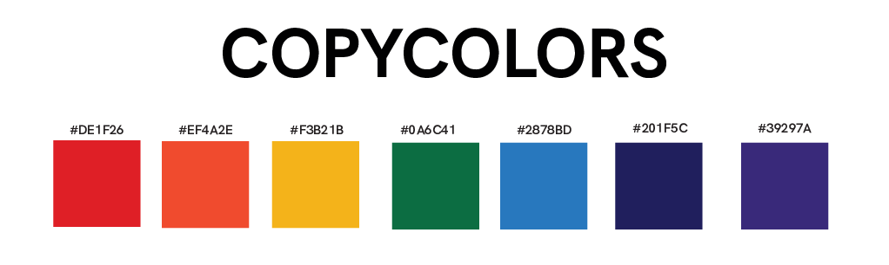

**copycolors** is command-Line Interface to  extract faster the dominant colors from local or remotes images.
It is built with Rust and is essentially based on the implementation the *Colors Thief* algorithm written by  
[Yevhenii Reizner](https://github.com/RazrFalcon/color-thief-rs).

## Installation

 copycolors CLI can be installed from different sources: 

 - You can get sources and pre-built binaries for the latest release of Typst from the [releases page](https://www.github.com/abdoulma/copycolors/releases).

- If you have a Rust toolchain installed, you can also install the latest development version with `cargo install --git https://github.com/abdoulma/copycolors` or more simply you can install the stable version with `cargo install copycolors`

## Usage
 
copycolors comes with a set of features, you can use via the arguments.

### Basic example

```bash
# For a local image file example.png 
copycolors example.png 
# or 
copycolors path/to/example.png
 
# For remote image 
copycolors "https://www.example.com/png"
```


You can choose the numbers of colors, you want to extract with the `--nb-colors` option (or with its shortest version `-n`). The default value is `5`.

```
copycolors example.png -n 8 
```

If you want to display the `rgb` value of colors instead of hexadecimal, you can use the `--rgb` (or `-r`) flag. 

```
copycolors example.png -r 
```

If you want a better and larger perception of the colors extracted, you can use the `--canvas`  (or `-c`)  flag to display the colors as rectangle. 

As, I know that it can be frustating to have some colors we don't want extracted, there is an option `exc-colors` (or `-e`), you can use to specify to hexadecimal  version of colors you want to exclude from the extraction. Underhood, there is a method filtering  out  colors distant at less than `5 %` from the colors you want to exclude.

```
# Put the colors hexadecimal values between quotations marks
copycolors example.png -c -e "#A4E14b" "#84C512" 
```

The last helpful options is the extracted colors sorting by their contrasts with white colors with the flag `--bcw` orthe opposite with the flag  `--bcb`. 

```
# Sort by colors best contrasting with white
copycolors example.png --bcw

# Sort by colors best contrasting with black
copycolors example.png --bcb
```

The supported images formats are: 
 
|Format| Extension|
|:-------|:------|
|E ||

You can access the CLI help with `--help` (`-h`) flag. 

```
copycolors -h
```

## Contributing

If you experience bugs, feel free to open an issue or send a PR with a fix. For new features, I would invite you to open an issue first so we can explore the design space together.